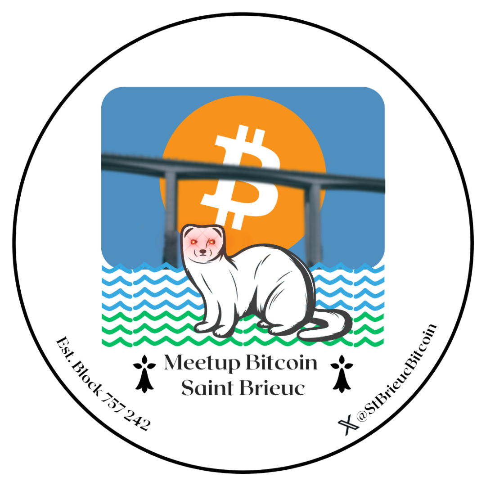
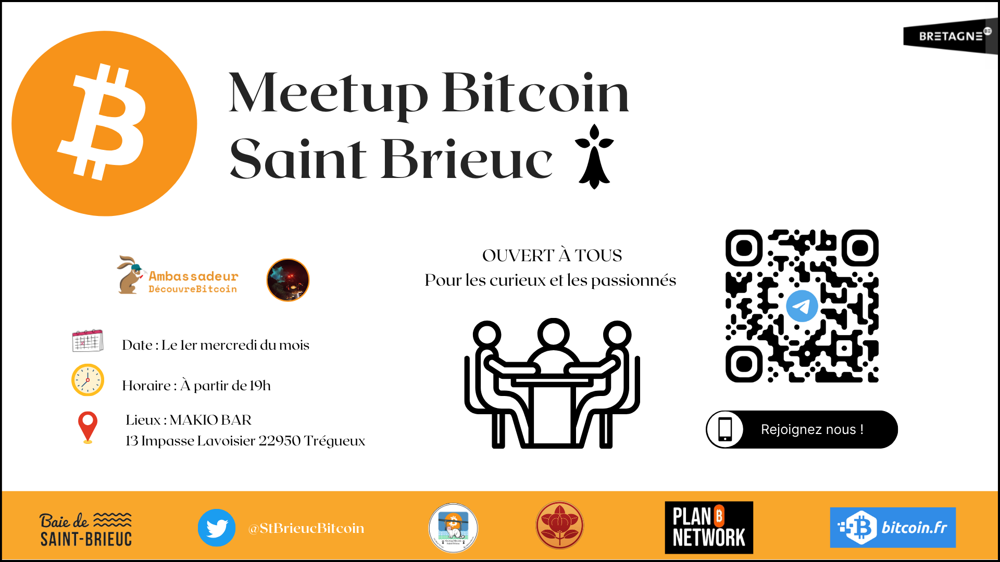

# 🟠 Meetup Bitcoin - Saint-Brieuc

Bienvenue sur le dépôt GitHub officiel du **Meetup Bitcoin de Saint-Brieuc** (Côtes-d'Armor, Bretagne) 🇫🇷  
Un rendez-vous convivial et régulier pour échanger autour de **Bitcoin**, de la souveraineté numérique et de la liberté monétaire.

📍 Suivez-nous aussi sur X (Twitter) : [@StBrieucBitcoin](https://x.com/StBrieucBitcoin)

---

## 💡 Objectif du Meetup

L'objectif est de réunir les curieux, utilisateurs, entrepreneurs, développeurs ou simples passionnés de Bitcoin autour de discussions ouvertes, d’ateliers pratiques et de présentations pédagogiques.  
Pas de trading ici, seulement du **Bitcoin** (pas de shitcoins 💩).

---

## 📚 Ce dépôt GitHub

Ce dépôt contient toutes les ressources partagées pendant nos meetups :

- 📖 Présentations en PDF ou en Markdown
- 📸 Photos & affiches d’événements
- 🔗 Liens utiles (podcasts, vidéos, sites de référence)
- 💬 Fiches récapitulatives et documentation partagée

---

## 🗓 Événements passés et à venir

| Date       | Thème                                       | Lien ressource             |
|------------|---------------------------------------------|----------------------------|
| 2025-01-08 | Bonne Année               |(https://x.com/StBrieucBitcoin/status/1877072908461228438) |
| 2025-02-05 | Crypto Cartoon & Sauces Piquantes                |(https://x.com/StBrieucBitcoin/status/1887407988165447824) |
| 2025-03-05 | Discussion libre                |(https://x.com/StBrieucBitcoin/status/1897231114605052262)  |
| 2025-04-02 | Discussion libre                     | (https://x.com/StBrieucBitcoin/status/1907471359787299025) |
| 2025-05-07 | Présentation Satoshi Index       | (https://x.com/StBrieucBitcoin/status/1920359524810076189)                    |
| 2025-06-04 | Retour conférence BEF                |     (https://x.com/StBrieucBitcoin/status/1930178393569411394)                       |
| 2025-07-02 | Discussion Libre                |      (https://x.com/StBrieucBitcoin/status/1940023754760880277)                      |
| 2025-08-06 | Discussion Libre                |     (https://x.com/StBrieucBitcoin/status/1953111454275535157)                       |
| 2025-09-04 | Présentation et Installation Projet sur ESP32                |       (https://x.com/StBrieucBitcoin/status/1962737107702612231)                     |
| 2025-10-08 | Discussion Libre                |        (https://x.com/StBrieucBitcoin/status/1975894950576541929)                    |
| 2025-11-05 | Discussion Libre                |        (https://x.com/StBrieucBitcoin/status/1986049217412878461)                    |
| 2025-10-03 | (nouvelles dates à venir...)                |                           |

---

## 🧰 Outils recommandés

Quelques outils et services souvent mentionnés lors des discussions :

- [Phoenix Wallet](https://phoenixwallet.org/)
- [Bitcoin Core](https://bitcoincore.org/)
- [GetAlby](https://getalby.com/)
- [bitcoiner.guide](https://bitcoiner.guide/)

---

## ✊ Valeurs du groupe

- **Souveraineté individuelle** 🛡️  
- **Respect de la vie privée** 🕵️  
- **Pas de bullshit, que du Bitcoin** 🧡  
- **Accessibilité et pédagogie** 📣  

Tous niveaux bienvenus !

---

## 🧡 Contact & Soutien

Tu veux nous rejoindre, proposer un sujet ou soutenir le projet ?  
Écris-nous ou retrouve-nous sur :  
📬 [@StBrieucBitcoin](https://x.com/StBrieucBitcoin)  
⚡️ Don Bitcoin via Lightning : `Scuba_Wizard@getalby.com`  
(ou via QR code lors des meetups)

---

## 📝 Licence

Ce dépôt est en licence MIT.  
Les contenus pédagogiques peuvent être librement réutilisés, remixés et partagés, avec mention de la source.

---

_À bientôt autour d’une pinte 🍻 et d’un bloc 𝔹 !_
